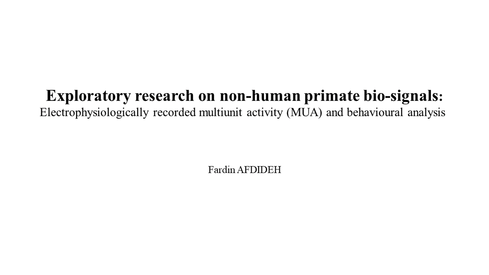
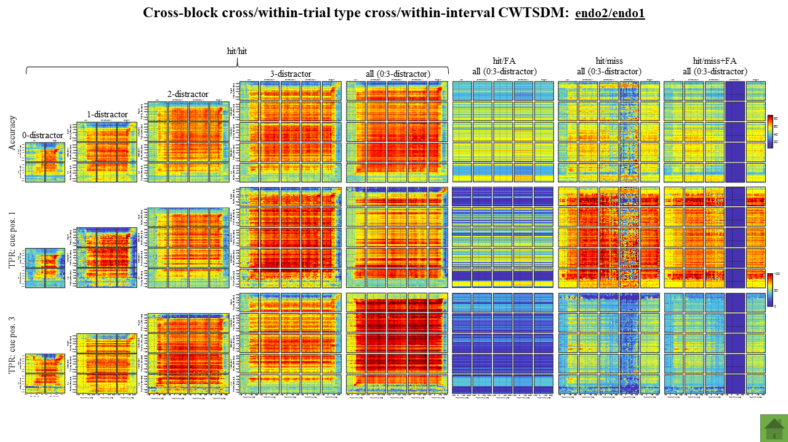
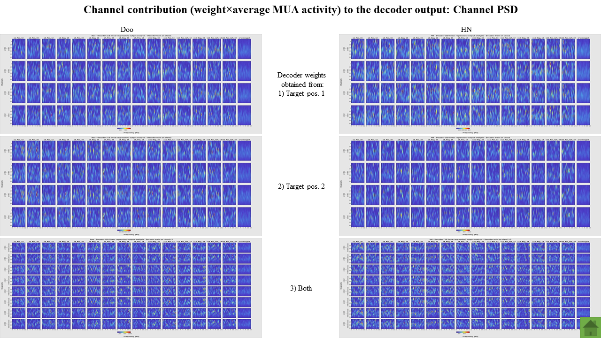
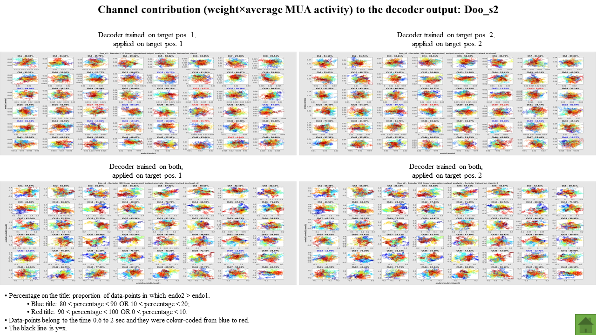
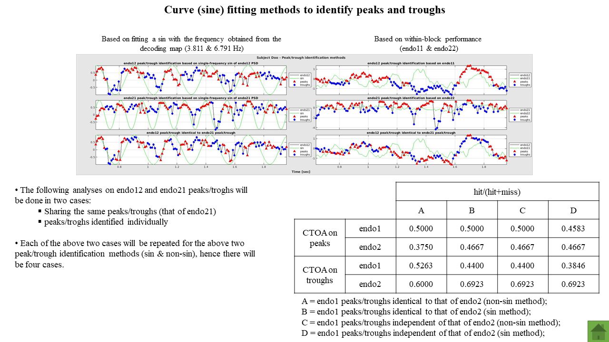
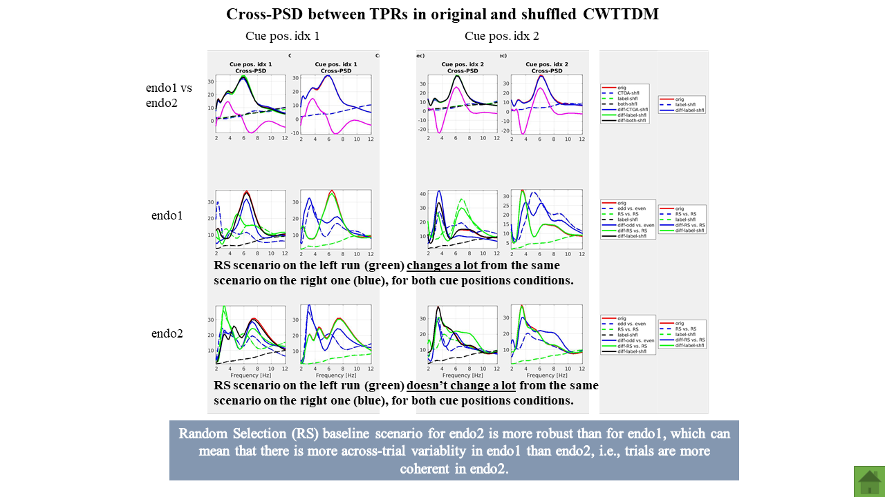
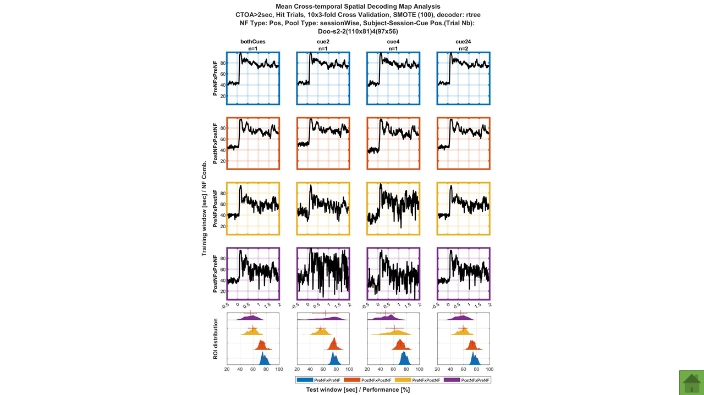

# Neural dynamics of attentional modulation of macaque brains using neurofeedback techniques in an invasive cognitive brain-computer interface setup
The use of classification procedures to decode brain activity associated to specific aspects of human behaviour is the basis of brain-computer interface (BCI). Classically applied in motor-related activities, an increasing amount of evidence suggests the feasibility to develop BCI technologies relying on higher-order cognitive functions such as attention. In this context, prior studies have succeed in decoding the attentional spotlight (AS) with a high temporal resolution, allowing to understand the dynamics of the attentional system during its active engagement, but also to envision the development of neurofeedback (NF) approaches to increase attentional resources. In this context, we trained two macaques monkeys to perform a 100% validity cued endogenous attentional task while multiunit activity (MUA) was intra-cranially recorded from both Frontal Eye Fields. During the task performance, position of the AS was decoded in real-time and, when the AS was in the cued quadrant, a feedback was provided in form of a sensory information (sound) and reward (water intake). 
We found that attention position was encoded differently after the NF. Specifically, we observed that after NF the spatial prefrontal population code for attention changed dynamically during the cue-to-target interval, showing an alternation between a new code and the pre-NF code. We computed the frequency of this code alternation and we found that both codes systematically alternate within the theta (4-7Hz) band, which is associated with the learning of new contingencies. Interestingly, the phase of this oscillation accounted for significant variations in behavioural performance, suggesting that these NF-induced oscillations impact both function and behavior. 
These results demonstrate for the first time that (i) the application of attention-related NF modulates how the prefrontal cortex encodes information and (ii) these changes are a functional signature that accounts for behaviour. Altogether, our data envision the feasibility of the NF-based interventions in the attention domain with potential applications in healthy population or as a treatment for attention disorders.

## NeuroFrance 2021 - FENS 2022

## Time-resolved Results (Developed Toolbox)
* Cross/Within-temporal Spatial Decoding Map;
* Temporal Analysis:
  * Raw Accuracy Time-series;
  * Granger Causality Test.
* Spectral Analysis:
  * Auto/Cross-wavelet Power Spectral Density (PSD);
  * Coherence Spectral Analysis;
  * Granger Causality Spectral Analysis;
  * Phase Slope Index.
* Time-frequency Representation:
  * Auto/Cross-spectrogram;
  * Coherogram.
* Relative Phase Analysis:
  * From Cross-spectrogram;
  * From Cross-coherogram.
  

## Cross/Within-Temporal Decoding Map PSD (Regular and Baseline-corrected) Computation, Visualisation and Statistical Test (Two/one-sided Wilcoxon Signed Rank Sum) for All Experimental Conditions and their Combinations (Developed Toolbox) 

## Cross/Within-Temporal Decoding Map PSD (Regular and Corrected Versions) Computation, Visualisation, Statistical Test (Two/one-sided Wilcoxon Signed Rank Sum), and Behavioural Analysis for All Experimental Conditions and their Combinations (Developed Toolbox) 

## Statistical (Two-sided Wilcoxon Signed Rank Sum) Comparison of the Optimal Frequency, Phase, and Behavioural Performance between PreNF and PostNF, and Peak Frequencies Comparison Obtained from Behavioral and Electrophysiological Analyses in the User-Specified Frequecy-Of-Interest (FOI) (Developed Toolbox)

## The Effect of Class Balancing Techniques on the Cross/Within-Temporal Decoding Maps (Accuracy and True Positive Rate) (Developed Toolbox)
* Minimum;
* Synthetic Minority Oversampling Technique (SMOTE);
* BorderlineSMOTE;
* SafeLevelSMOTE;
* ADASYN.
 

## Significance of the Cross-wavelet PSD Peak Considering the Relative Phase Tested on Simulated Noisy (Different SNRs) Oscillatory (Different Frequencies) Time-series (Developed Toolbox)

## Time-resolved Decoder (2D Regressor) Output

## Binning Designer: Binning Parameters Effects on the Frequency Content of the Binned Signal
For further details, please visit [here](https://github.com/fardinafdideh/binning-designer).

## Exploratory Research on Non-human Primate Bio-signals

